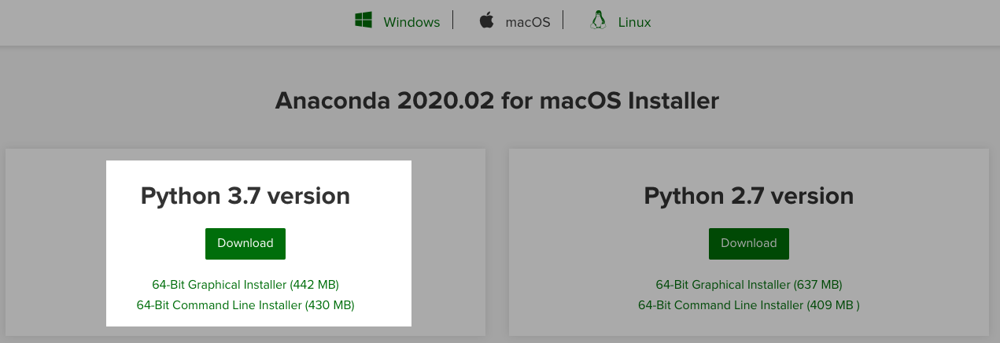

# Análise Exploratória do COVID-19 no Estado do Ceará

O objetivo desse projeto é realizar um workshop para todos que desejem aprender python e utilizá-lo para explorar dados. 
A idéia é utilizar as informações do COVID-19 do estado do Ceará disponibilizados na base do [IntegraSUS](https://integrasus.saude.ce.gov.br/).

O Workshop será apresentado no [Open Data Day Fortaleza](https://www.facebook.com/opendatadayfortaleza/) que ocorrerá no dia 11/04/2020. 

Fontes de Informação: 
- [Corona Virus Ceará](https://indicadores.integrasus.saude.ce.gov.br/indicadores/indicadores-coronavirus/coronavirus-ceara)

- [Conjunto de APIs](https://github.com/EscolaDeSaudePublica/coronavirusAPI/issues/17)

### Exemplo de Resultados

## Organização do Tutorial 

 1) Instalação do Ambiente  
 2) Configuração do Ambiente
 3) Extração de dados e formação dos Datasets
 4) Limpeza dos dados 
 5) Visualização de dados 

## Instalação do Ambiente

Iremos utilizar o [Anaconda](https://www.anaconda.com/why-anaconda/), um ambiente completo para desenvolvimento de trabalhos de Ciência de Dados que torna fácil o controle de dependências e compartilhamento de trabalhos independente do sistema operacional ou linguagem. 

Esse ambiente facilita muito a instalação de dependências e de ferramentas e pode ser utilizado para desenvolvimento em [R](https://www.r-project.org/) ou [Python](https://www.python.org/). 

Como linguagem, iremos utilizar [Python](https://www.python.org/). 

Para estudos e exploração, iremos utilizar o [Jupyter](https://jupyter.org/). 

Para exibir os gráficos de resultados, iremos utilizar a lib [Plotly](https://plotly.com/).

### Instalação e Configuração do Ambiente Base

Siga o conjunto de passos abaixo para instalar o ambiente: 

 1. __Executar procedimentos de instalação descritos no link abaixo:__ 

> [Instalação Anaconda](https://docs.anaconda.com/anaconda/install/)
Observe que pode selecionar as intruções de acordo com seu sistema operacional. 

<!--  -->

> Escolher a opção Python 3.7 e 64-Bit. 

 2. __Após finalizar a instalação, vá no menu do seu Sistema Operacional e inicie o aplicativo _Anaconda Navigator_.__

 3. __Crie um novo ambiente de desenvolvimento do seu projeto. Utilizei covid-19-ce.__

 >Esse ambiente é uma forma de isolar todo seu desenvolvimento e conjunto de bibliotecas. 
 
3. __Instalar o Jupyter Notebook__

4. __Espere finalizar a instalação e inicie o Jupyter__

O Jupyter é uma aplicação web na qual você pode criar um documento que inclui scripts juntos com explicações dos passos que estão sendo executados. 
Para texto utilizaremos a sintaxe de [Markdown](https://pt.wikipedia.org/wiki/Markdown) e para scripts utilizaremos [Python]

## Configuração de dependências 

## Metas

- [x] Gerar arquivo facilmente explorável por qualquer área: CSV e Excel. 
- [ ] Como está o achatamento da curva para nosso estado? 
- [x] Análise das contagens de casos testados, confirmados, negativados e óbitos por município organizado em série temporal
- [x] Exibição de gráficos animados de exemplo
- [ ] Realizar estudos em conjunto com outros dados de outras fontes como IBGE, etc. 
- ... 

 ## Artigos Diversos Usados Como base e Inspiração

 [Predicting the future of the Covid-19 pandemic with data](https://healthcare-in-europe.com/en/news/predicting-the-future-of-the-covid-19-pandemic-with-data.html#)

 [Criando Dashboards com Plotly Dash](https://medium.com/datadummies/parte-01-criando-dashboards-com-plotly-dash-158211c9fa6a)

